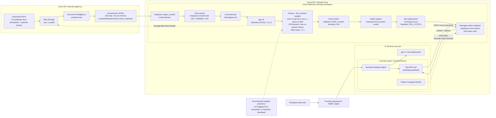

# Train a new employee model from scratch on Azure ML

Trains a **new language model from random weights** — no Qwen, no pretrained
checkpoint, no downloaded tokenizer — on the ten employee documents
(timesheets and expense reports), serves it from an Azure ML managed online
endpoint, and puts a Foundry agent in front of it. The model answers
employee questions from its own weights, with no document supplied.

```
Blob (employee JSONL)  ->  Azure ML job: causal Transformer from scratch (T4, 77 s)  ->  Model registry
                                                                                             |
User -> Foundry agent (gpt-4.1-mini) -> OpenAPI tool -> Managed online endpoint (CPU) <------+
```

The model: 4-layer causal Transformer, d=256, 4 heads, 3.2 M parameters,
word-level vocabulary of 188 tokens built from the training rows. Task:
closed-book recall — question in, answer sentence out — with the loss taken on
answer tokens only. Result: **100 % exact match on validation, 74 % on a
phrasing it never saw**.

This is the second of three ways the project gives a model knowledge:

| Dataset | Method | Where the knowledge lives | Repo |
|---|---|---|---|
| Finance | fine-tune Qwen2.5-3B (QLoRA) | adapter weights | Azure-FineTuning-Foundry-Agent |
| Employee | new model trained from scratch | the model's weights | this repo |
| HR | RAG | an index, read at inference | Azure-HR-RAG |

It reuses the Azure ML workspace, GPU cluster, AI Services account and
Foundry project created by the fine-tuning repo's Terraform — nothing new is
provisioned here.

---

## Workflow diagram

Source of truth: [Lucid page](https://lucid.app/lucidchart/ea992a4c-6424-4793-a94e-5d7fd2ea7384/edit?page=I8_u1Xb-MsYy) (same diagram, editable). The Mermaid copy below renders on GitHub.



Same shape as the fine-tuning track but nothing is downloaded: `train.py` builds the word
vocabulary from the rows and trains the 4-layer transformer from random weights (3.2M
parameters, 4000 steps, ~77 s on the T4), the checkpoint is registered and served on a CPU
`Standard_DS1_v2`, and the Foundry agent reaches it through the `askEmployeeModel` OpenAPI
tool with the project identity's AAD token. Boxes map to Step 1 (data assets), Step 2 (job),
Step 3 (deployment), Step 4 (agent), Step 5 (Copilot).

## Azure services used

Everything below already exists from the fine-tuning repo; this project adds
one endpoint, one agent and three data assets to it.

| Service | What it does in this project |
|---|---|
| **Blob Storage** (ingestion account) | holds the employee closed-book JSONL under `curated/datasets/closed_book_employee/` |
| **Document Intelligence** | OCR of the employee PDFs (ingestion repo) |
| **AML datastore `ingest_curated`** | lets the workspace read that container without keys |
| **AML data assets** `employee-closed-book-{train,validation,test}` | versioned pointers to the three JSONL files |
| **AML compute cluster `gpu-t4`** | runs `train.py` for 77 s; no pretrained weights are downloaded |
| **AML model registry** | versions the checkpoint (`employee-from-scratch-model`) with its vocabulary inside |
| **AML managed online endpoint** (`employee-from-scratch`, `Standard_DS1_v2`) | serves the 3.2M-parameter model on one CPU core; AAD token auth |
| **Container Registry** | builds the torch-only training and serving images |
| **AI Services account + `gpt-4.1-mini`** | the agent's reasoning model |
| **Foundry project `docintel-finance`** | hosts `docintel-employee-agent` and its OpenAPI tool `askEmployeeModel` |
| **Managed identity + Entra ID RBAC** | the project identity gets AzureML Data Scientist on the new endpoint (the script grants it) |
| **Azure Bot Service** (optional, created by Publish) | exposes the agent in Microsoft 365 Copilot |

---

## Prerequisites

- Steps 1 and 5 of **Azure-FineTuning-Foundry-Agent** have run: the workspace,
  `gpu-t4` cluster, datastore `ingest_curated`, AI Services account with
  `gpt-4.1-mini`, Foundry project `docintel-finance` and your Foundry User
  role all exist
- The ingestion repo has run with `build_closed_book.py --dataset employee --upload`,
  so `curated/datasets/closed_book_employee/{train,validation,test}.jsonl`
  are in its Blob container
- Azure CLI with the ML extension, Python 3.11+, `az login`

```bash
python -m venv .venv-agents
.venv-agents/Scripts/pip install -r foundry/requirements.txt
```

On Windows run the commands from Git Bash and put
`MSYS_NO_PATHCONV=1 PYTHONIOENCODING=utf-8` in front of the Python scripts.
`<workspace>` is the fine-tuning repo's `terraform output ml_workspace`.

---

## Step 1 — data

Register the three Blob files as data assets. They are read through the
credential-less datastore, so nothing is copied:

```bash
cd data
az ml data create -f closed_book_train.yml      -g docintel-ml-rg -w <workspace>
az ml data create -f closed_book_validation.yml -g docintel-ml-rg -w <workspace>
az ml data create -f closed_book_test.yml       -g docintel-ml-rg -w <workspace>
```

330 training phrasings over 30 facts (11 per fact), 33 validation, 66 test
rows using a wrapper the model never trains on. Each row:

```json
{"task": "recall", "instruction": "How many hours did Jonas Weber work?",
 "input": "", "output": "Jonas Weber (EMP-8373) logged 42.2 hours for the week ending 2026-05-04."}
```

---

## Step 2 — train

```bash
cd training
az ml job create -f job.yml -g docintel-ml-rg -w <workspace> --query name -o tsv
```

`job.yml` runs `train.py` on `gpu-t4` with only `torch` installed:

| Setting | Value | Why |
|---|---|---|
| initialisation | random | the point of the exercise — no pretrained weights anywhere |
| tokenizer | word-level, built from the training rows | ids, dates and amounts stay whole tokens (`EMP-8373`, `2026-05-04`, `42.2`) |
| architecture | 4 pre-norm decoder blocks, d=256, 4 heads, tied output head | 3.2 M parameters |
| sequence | `<bos> question <sep> answer <eos>`, context 96 | rows are ~30 tokens |
| loss | answer tokens + `<eos>` only | learns question → answer, not question text |
| steps / batch | 4000 / 64 | 77 s on the T4 |
| augmentation | random lower-casing, punctuation, greeting prefixes | so it does not key on exact wording |

The log ends with the scores and five test predictions:

```
final validation exact match=1.000  test (unseen phrasing) exact match=0.742
  [ok] I don't have the document to hand. Hugo Lindqvist timesheet hours?
       -> Hugo Lindqvist (EMP-8582) logged 41.4 hours for the week ending 2026-08-04.
```

Phases: `Preparing` (image build, ~10 min first time) → `Queued` → `Running`
(under 2 min). Cost: a few cents.

To try it on a laptop first, the same script runs on CPU against the local
JSONL from the ingestion repo (~3 min for 300 steps, already ~40 % accurate):

```bash
D=../AWS-Document-Ingestion-Textract/data/closed_book_employee
python training/train.py --train-data $D/train.jsonl --validation-data $D/validation.jsonl \
  --test-data $D/test.jsonl --output-dir /tmp/emp --steps 300 --batch-size 32
```

---

## Step 3 — register and serve

```bash
az ml model create -g docintel-ml-rg -w <workspace> \
  --name employee-from-scratch-model --type custom_model \
  --path azureml://jobs/<job>/outputs/model

cd serving
az ml online-endpoint create   -f endpoint.yml   -g docintel-ml-rg -w <workspace>
az ml online-deployment create -f deployment.yml -g docintel-ml-rg -w <workspace> --all-traffic
```

`endpoint.yml` sets `auth_mode: aad_token` — no keys. `deployment.yml` runs
`score.py` on a **`Standard_DS1_v2`** (1 vCPU, ~USD 0.06/hour): a 3 M-parameter
model needs no GPU and answers in 130–300 ms. The scorer walks the mounted
model folder for `employee_model.pt`, which carries its own vocabulary and
architecture config. Deployment takes ~10 minutes.

Test:

```bash
PYTHONIOENCODING=utf-8 python serving/test_endpoint.py
python serving/test_endpoint.py --ask "What project was Chloe Nguyen on?"
```

```
Q  How many hours did Jonas Weber work?
A  Jonas Weber (EMP-8373) logged 42.2 hours for the week ending 2026-05-04.   [301.8 ms]
Q  What is the status of Aisha Rahman's expense report?
A  Expense report EXP-70486 for Aisha Rahman is Reimbursed.   [135.1 ms]
```

---

## Step 4 — the Foundry agent

```bash
MSYS_NO_PATHCONV=1 PYTHONIOENCODING=utf-8 .venv-agents/Scripts/python foundry/create_agent.py
```

The script finds the workspace, the AI Services account and the endpoint's
scoring URI by itself, grants the Foundry project's identity **AzureML Data
Scientist** on the endpoint if it does not have it, creates (or updates)
`docintel-employee-agent` on `gpt-4.1-mini` with the endpoint as an OpenAPI
tool authenticated by managed identity, then asks three questions:

```
Q  What are the total hours for EMP-8373?
A  Jonas Weber (EMP-8373) logged 42.2 hours for the week ending 2026-05-04.
   tool called: yes
Q  Did Farhan Malik work overtime?
A  Farhan Malik recorded 0.3 hours of overtime for the week ending 2026-08-18.
   tool called: yes
Q  What is the capital of France?
A  The capital of France is Paris.
   tool called: NO
```

`--ask "..."` sends your own question. Re-running updates the agent in place.

**Portal:** https://ai.azure.com → New Foundry → project `docintel-finance` →
Agents → `docintel-employee-agent` → Save as new agent → Playground.

**After migrating.** "Save as new agent" copies the agent into the versioned
agent API; from then on the copy is independent of the classic one the script
created. The portal also adds a `web_search` tool to the copy, which can let
gpt-4.1-mini answer from the web instead of the model - remove it in the
portal or run the script below, which also does that. Whenever you change
`INSTRUCTIONS` in `foundry/create_agent.py`, push them to the migrated copy with:

```bash
MSYS_NO_PATHCONV=1 PYTHONIOENCODING=utf-8 .venv-agents/Scripts/python foundry/publish_version.py
```

It publishes a new version (`docintel-employee-agent:2`, `:3`, ...) with the same model and
tools; the playground and Copilot pick up the latest version automatically.

---

## Step 5 — publish to Microsoft 365 Copilot (optional)

In the migrated agent click **Publish → Teams and Microsoft 365**, fill in the
descriptions, keep the generated bot name, and finish. This creates an Azure
Bot Service (free F0) and a service principal named
`<ai-services-account>-docintel-finance-docintel-employee-agent-AgentIdentity` that the bot
runs as. That identity has no roles until you grant them:

```bash
AIS=$(az cognitiveservices account list -g docintel-ml-rg --query "[?kind=='AIServices'].id | [0]" -o tsv)
AGENT_SP=$(az ad sp list --display-name "$(basename $AIS)-docintel-finance-docintel-employee-agent-AgentIdentity" --query "[0].id" -o tsv)
MSYS_NO_PATHCONV=1 az role assignment create --assignee-object-id $AGENT_SP --assignee-principal-type ServicePrincipal \
  --role 53ca6127-db72-4b80-b1b0-d745d6d5456d --scope $AIS   # Azure AI User / Foundry User
EP=$(az ml online-endpoint show -n employee-from-scratch -g docintel-ml-rg -w <workspace> --query id -o tsv)
MSYS_NO_PATHCONV=1 az role assignment create --assignee-object-id $AGENT_SP --assignee-principal-type ServicePrincipal \
  --role "AzureML Data Scientist" --scope $EP
```

Until the roles propagate (a few minutes) the agent appears in Copilot but
replies with nothing. Then: https://copilot.microsoft.com → Agents →
`docintel-employee-agent` → new chat.

---

## Test questions

The ten documents: timesheets for Jonas Weber, Hugo Lindqvist, Farhan Malik,
Chloe Nguyen, Isabel Moreno; expense reports for Noah Fischer, Keiko Tanaka,
Ben Carter, Aisha Rahman, Elena Petrova.

| Ask | Expect |
|---|---|
| How many hours did Jonas Weber work? | EMP-8373, 42.2 hours, week ending 2026-05-04 |
| Did Farhan Malik work overtime? | 0.3 hours, week ending 2026-08-18 |
| What project was Chloe Nguyen on? | PRJ-3307, approved by S. Brooks |
| What is the status of Aisha Rahman's expense report? | EXP-70486, Reimbursed |
| How much did Noah Fischer claim in expenses? | $1,417.60 on EXP-87838 |
| How many hours did Isabel Moreno work? | EMP-9850, 35.7 hours |
| What is the capital of France? | answered by gpt-4.1-mini, no tool call |

Known limit: an employee who is not in the ten (e.g. "Grace Kim") gets
another employee's answer instead of a refusal. The training set has one
refusal handle; a from-scratch model needs many more to learn the pattern.
The agent adds a one-line caveat when the answer names someone else.

---

## What "from scratch" means here — and what it does not

The model learned English word order, the answer templates, every employee's
id, dates and amounts, and the mapping from question to fact, from 330 rows in
77 seconds. It knows nothing else: no general vocabulary, no arithmetic, no
world. It cannot answer a question about an eleventh employee, and it is
brittle to wording it never saw (74 % on the held-out phrasing vs 100 % on
seen ones). That is the honest trade-off against the finance track, where
Qwen brought the language and only the facts were taught.

---

## Cost and teardown

| Component | Cost |
|---|---|
| Training | a few cents per run (`gpu-t4` scales to zero) |
| Endpoint on DS1_v2 | **~USD 0.06/hour while deployed** |
| gpt-4.1-mini | per token |

```bash
az ml online-endpoint delete -n employee-from-scratch -g docintel-ml-rg -w <workspace> -y
```

Everything else belongs to the fine-tuning repo's Terraform.

---

## Files

```
data/
  closed_book_{train,validation,test}.yml   data assets on the ingestion Blob datastore
training/
  job.yml            command job on gpu-t4, torch only
  train.py           tokenizer, model, training loop, exact-match evaluation
  environment.yml
serving/
  endpoint.yml, deployment.yml   AAD-only endpoint on a DS1_v2
  score.py                       same tokenizer + model class; greedy decoding
  environment.yml, test_endpoint.py
foundry/
  create_agent.py                agent + OpenAPI tool + role grant + test
  publish_version.py             pushes new INSTRUCTIONS to the migrated (versioned) agent
  employee-model.openapi.yaml    the tool definition; servers[] filled in at run time
  requirements.txt
archive/
  train_from_scratch_v1_char.py, score_v1_char.py   first attempt: character-level, produced gibberish
  qwen-lora/                                        the alternative: LoRA on Qwen with the same data
```

The tokenizer regex and the model class in `serving/score.py` must stay
identical to `training/train.py`.
